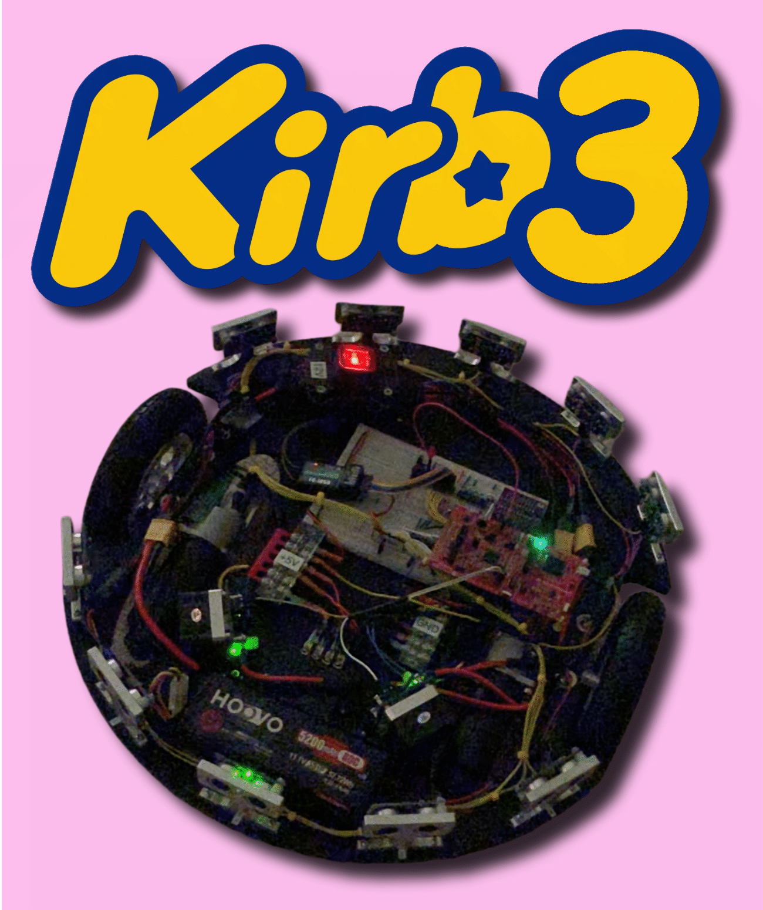

# Kinematic Intelligent Ranging Bot (KIRB-3)
Code and resources for Kirb-3, a remote-controlled, distance-sensing robot built around the TI LP-MSPM0G3507. The project replaces legacy trainer-board hardware with a purpose-built embedded platform and currently supports multi-channel RC control alongside a round-robin ultrasonic sensing array. Development is ongoing as encoder feedback is introduced as the first step toward odometry and future mapping capabilities.

  

